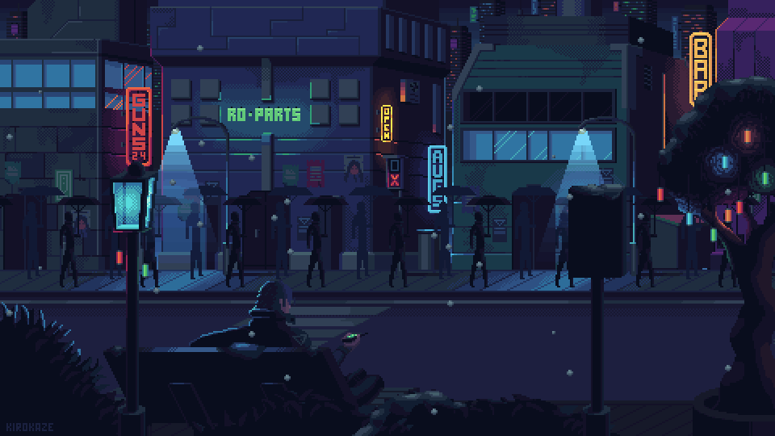

<h1 align="left">Hey there! I’m Yoko Hermanto from Indonesia.👋🏻</h1>

###

I’m a website developer who loves creating cool and easy-to-use websites. Besides coding, I’m really into gaming, making graphic designs, and watching anime, my go-to sources of fun and inspiration. I’m currently studying at Bina Nusantara University (Binus) and always looking to learn new things.

###

<h2 align="left">💻 Tech Stack:</h2>

###

  
  
  
  
  
  
  
  
  
  
  
  
  
  
  
  
  

###

<h2 align="left">🎶Music:</h2>

###

  

###

<picture>
  <source media="(prefers-color-scheme: dark)" srcset="https://raw.githubusercontent.com/YokoHermanto1/YokoHermanto1/output/github-snake-dark.svg" />
  <source media="(prefers-color-scheme: light)" srcset="https://raw.githubusercontent.com/YokoHermanto1/YokoHermanto1/output/github-snake.svg" />
  
</picture>

